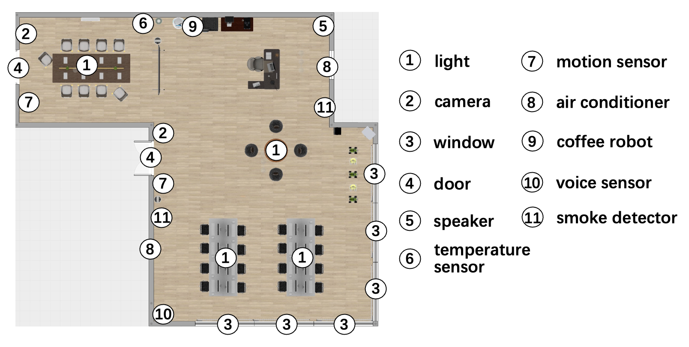
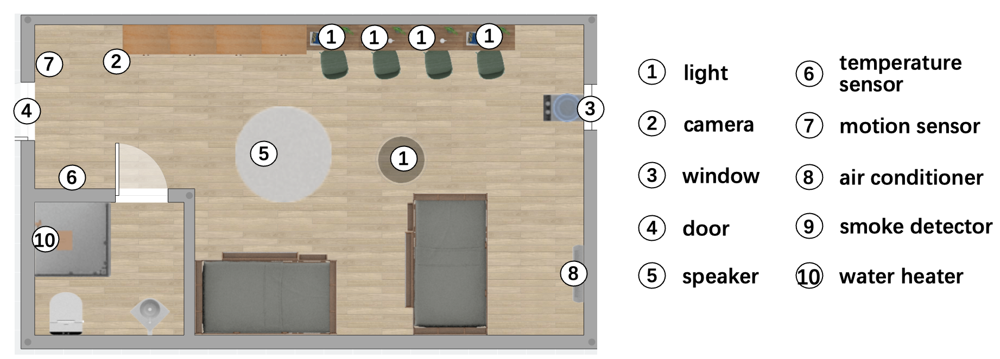
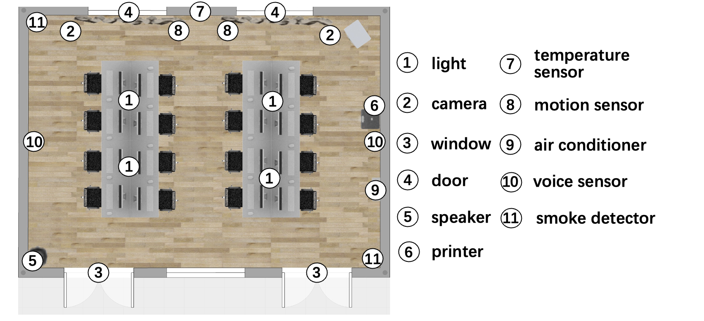

# laTAPE.github.io

We evaluated laTAPE in three environments (smart office, smart building, and smart home) to address the following questions:

RQ1: **Usability** - Can users construct applications to meet requirements across different environmental scenarios?

RQ2: **Feasibility** - Can applications constructed by users successfully execute in real-world environments?

The spatial topology and device deployment for each environment can be referenced in Figure 1,2,3. In each environment, we will deploy the corresponding architecture and define the respective events and actions(see Figure 4,5). 

*Figure 1: Spatial Topology and Device Deployment of Building*

*Figure 2: Spatial Topology and Device Deployment of Home*

*Figure 3: Spatial Topology and Device Deployment of Office*