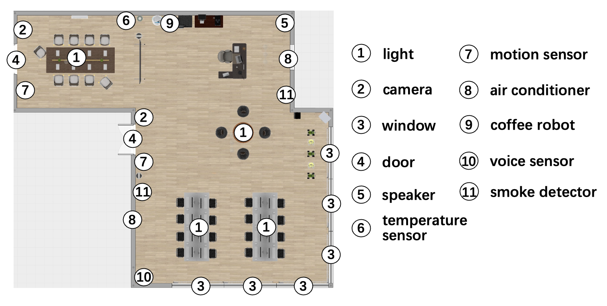
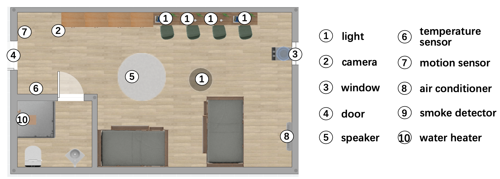
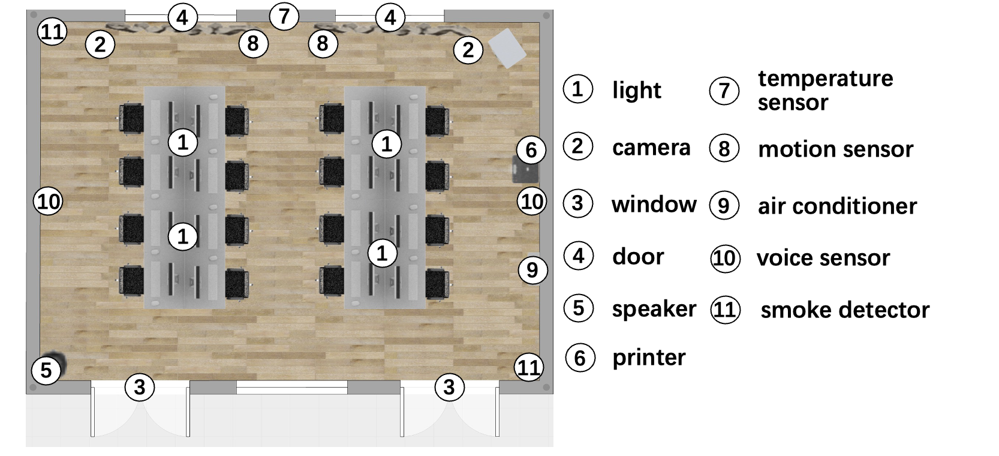

# laTAPE.github.io
laTAPE: A Tool for Constructing IoT Applications in Smart Environments

codes: [laTAPE](https://github.com/laTAPE/laTAPE.github.io.git)

video:

youtube:

bilibili:

 "laTAPE")

We evaluated laTAPE in three environments (smart office, smart building, and smart home) to address the following questions:

RQ1: **Usability** - Can users construct applications to meet requirements across different environmental scenarios?

RQ2: **Feasibility** - Can applications constructed by users successfully execute in real-world environments?

The spatial topology and device deployment for each environment can be referenced in Figure 1,2,3. In each environment, we will deploy the corresponding architecture and define the respective events and actions(see Figure 4,5). 

*Figure 1: Spatial Topology and Device Deployment of Building*

*Figure 2: Spatial Topology and Device Deployment of Home*

| Event Name | Event Description |
| -------- | -------- |
| Person_Entry | Indicates when a person enters a specified area or location. |
| Person_Leave | Indicates when a person leaves a designated area or location. |
| Printer_Start | Indicates the initiation of a printing process by a printer. |
| Printer_Finish | Indicates the  finishing of a printing process by a printer. |
| Light_On | Indicates the switching on of a light. |
| Light_Off | Indicates the or switching off of a light. |
| Fire_Alarm | Indicates the detection of smoke, fire. |
| Window_On | Indicates the opening of a window. |
| Window_Off | Indicates the closing of a window. |
| AC_On | Indicates the powering on of an air conditioner. |
| AC_Off | Indicates the powering off of an air conditioner. |
| Coffee_Start | Indicates the initiation of a coffee process. |
| Coffee_Done | Indicates the completion of a coffee process. |

*Table 1: Events in Environments*

| Action Name | Action Description |
| -------- | -------- |
| Light_Turn_On      | Initiates the process of turning on a light source.              |
| Light_Turn_Off     | Initiates the process of turning off a light source.             |
| AC_Turn_On         | Initiates the process of turning on an air conditioner.  |
| AC_Turn_Off        | Initiates the process of turning off an air conditioner. |
| Speak_VoiceMessage | Initiates the process of speaking a voice message.               |
| Open_SoundSystem   | Initiates the process of opening a sound system.                 |
| Make_Coffee         | Initiates the process of preparing a coffee.                      |
| Heater_Turn_On     | Initiates the process of turning on a water heater.                    |
| Heater_Turn_Off    | Initiates the process of turning off a water heater. 

*Table 2: Actions in Environments*
