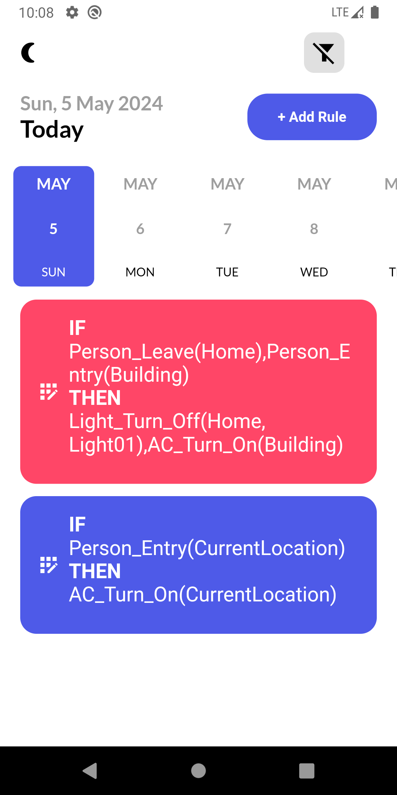
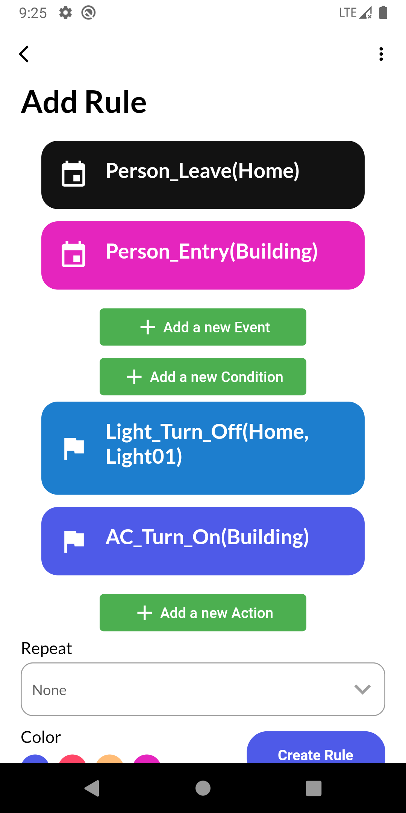

# laTAPE App

## Description

The Task Reminder App is a simple yet powerful task management application that enables users to add, edit, and delete tasks efficiently. Additionally, it offers features like task completion tracking, date sorting, notifications & reminder, and task export capabilities.

## Features

- Add, edit, and delete rules
- Add, edit, and delete events
- Add, edit, and delete actions
- Sort rules by date
- Dark Mode & Light Mode
- Easy Design

### Screenshots

- **Home Screen**
  
  

- **Add and Update Rules**
  
  
